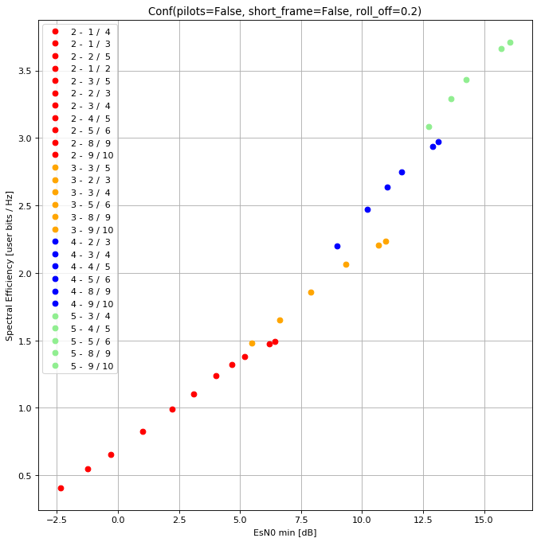

# DVB-S2 Adducere Mecum

DVB-S2 tools for answering questions regarding specific setups.

Inspired by [drmpeg's dvbs2rate.c](https://github.com/drmpeg/dtv-utils/blob/master/dvbs2rate.c).

## Efficiency in "user bits per Hertz":

### `Conf(pilots=False, short_frame=False, roll_off=0.2)`

|   |	1 / 4 |	1 / 3 |	2 / 5 |	1 / 2 |	3 / 5 |	2 / 3 |	3 / 4 |	4 / 5 |	5 / 6 |	8 / 9 |	9 /10 |
| - |	----- |	----- |	----- |	----- |	----- |	----- |	----- |	----- |	----- |	----- |	----- |
| 2 |	0.409 |	0.547 |	0.658 |	0.824 |	0.990 |	1.102 |	1.240 |	1.323 |	1.379 |	1.472 |	1.491 |
| 3 |	      |	      |	      |	      |	1.483 |	1.651 |	1.857 |	      |	2.065 |	2.205 |	2.233 |
| 4 |	      |	      |	      |	      |	      |	2.198 |	2.472 |	2.638 |	2.750 |	2.936 |	2.973 |
| 5 |	      |	      |	      |	      |	      |	      |	3.086 |	3.293 |	3.433 |	3.665 |	3.711 |

### `Conf(pilots=True, short_frame=False, roll_off=0.2)`

|   |	1 / 4 |	1 / 3 |	2 / 5 |	1 / 2 |	3 / 5 |	2 / 3 |	3 / 4 |	4 / 5 |	5 / 6 |	8 / 9 |	9 /10 |
| - |	----- |	----- |	----- |	----- |	----- |	----- |	----- |	----- |	----- |	----- |	----- |
| 2 |	0.399 |	0.534 |	0.642 |	0.804 |	0.967 |	1.076 |	1.210 |	1.291 |	1.346 |	1.437 |	1.455 |
| 3 |	      |	      |	      |	      |	1.450 |	1.613 |	1.815 |	      |	2.019 |	2.155 |	2.182 |
| 4 |	      |	      |	      |	      |	      |	2.146 |	2.414 |	2.575 |	2.685 |	2.866 |	2.902 |
| 5 |	      |	      |	      |	      |	      |	      |	3.019 |	3.222 |	3.359 |	3.586 |	3.631 |

### `Conf(pilots=False, short_frame=True, roll_off=0.2)`

|   |	1 / 4 |	1 / 3 |	2 / 5 |	1 / 2 |	3 / 5 |	2 / 3 |	3 / 4 |	4 / 5 |	5 / 6 |	8 / 9 |	9 /10 |
| - |	----- |	----- |	----- |	----- |	----- |	----- |	----- |	----- |	----- |	----- |	----- |
| 2 |	0.304 |	0.524 |	0.634 |	0.707 |	0.964 |	1.074 |	1.184 |	1.257 |	1.330 |	1.440 |	      |
| 3 |	      |	      |	      |	      |	1.438 |	1.602 |	1.766 |	      |	1.984 |	2.148 |	      |
| 4 |	      |	      |	      |	      |	      |	2.124 |	2.341 |	2.486 |	2.631 |	2.849 |	      |
| 5 |	      |	      |	      |	      |	      |	      |	2.911 |	3.091 |	3.271 |	3.542 |	      |

### `Conf(pilots=True, short_frame=True, roll_off=0.2)`

|   |	1 / 4 |	1 / 3 |	2 / 5 |	1 / 2 |	3 / 5 |	2 / 3 |	3 / 4 |	4 / 5 |	5 / 6 |	8 / 9 |	9 /10 |
| - |	----- |	----- |	----- |	----- |	----- |	----- |	----- |	----- |	----- |	----- |	----- |
| 2 |	0.298 |	0.513 |	0.620 |	0.692 |	0.943 |	1.051 |	1.158 |	1.230 |	1.301 |	1.409 |	      |
| 3 |	      |	      |	      |	      |	1.410 |	1.571 |	1.732 |	      |	1.946 |	2.107 |	      |
| 4 |	      |	      |	      |	      |	      |	2.088 |	2.301 |	2.444 |	2.586 |	2.800 |	      |
| 5 |	      |	      |	      |	      |	      |	      |	2.849 |	3.026 |	3.202 |	3.467 |	      |
